<h1 align="center">Hi there, I'm Ilias Laoukili! 👋</h1>

  <b>AI & Cybersecurity Engineering Student at ESIEE Paris</b> 
  <i>Building intelligent systems and securing digital infrastructure.</i>

  <a href="https://laoukili.com">🌐 Portfolio (laoukili.com)</a> •
  <a href="https://linkedin.com/in/ilias-laoukili">👔 LinkedIn</a> •
  <a href="mailto:ilias.laoukili@proton.me">📧 Email Me</a>

---

### 👨‍💻 About Me
I am a Master of Engineering student specializing in **Artificial Intelligence and Cybersecurity**. My academic background includes intensive preparatory classes in Physics and Advanced Mathematics (PCSI-PC).

- 🎓 **Education:** Master of Engineering @ ESIEE Paris (Class of 2027).
- 💼 **Goal:** Seeking a **4-month internship** between **May and August 2026**.
- 🧠 **Interests:** Machine Learning, Computer Vision, and Network Security.
- 📜 **Certifications:** Harvard CS50's Introduction to AI with Python.

---

### 🛠️ Tech Stack
**Languages**

**Tools & Platforms**

---

### 📊 GitHub Stats

  

